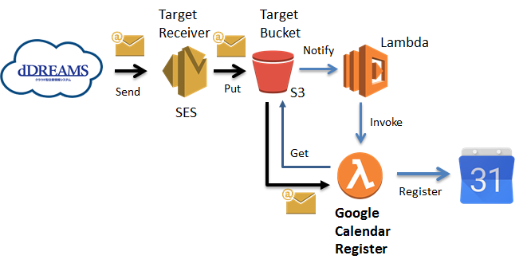

# Google Calendar Register
Google Calendar Register sync a schedule from dDREAMS to Google Calender via Email invitaion system when you make a schedule on dDREMAS.
Once you add target email address as a invitor. This Lambda detect the invitation email and register schedule according to the email.

## required environment value
* target_calendar_id = (Target Google Calender ID)
* target_email_address = (Email address for reciever)

## setup
* make a bucket on S3
* setup SES for Email receiver (require own domain)
* deploy lambda function with environmental value above
* setup trigger from the bucket (s3 put)

## known issues
* no support for schedule change notification (the schedule is registered but the original schedule is not deleted)
* no support for detele a schedule due to no notification of the deletion
